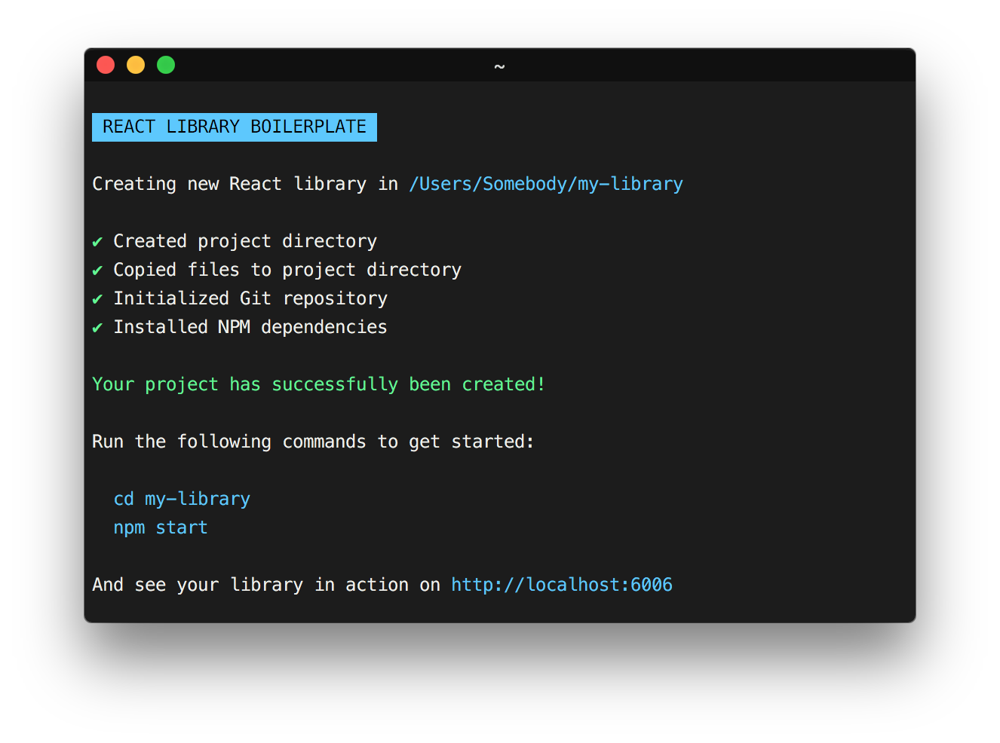

# react-library-boilerplate

[](https://github.com/smeuli/react-library-boilerplate/blob/master/LICENSE)
[](https://github.com/smeuli/react-library-boilerplate/pulls)

**Easily start building your React component library using this opinionated boilerplate.**

Included tools:

* Rollup and Babel for generating a bundle of your library in ES5
* Storybook for testing the UI of your component interactively
* ESLint and Husky for code linting

<p align="center">
  
</p>


## Usage

To create a new library, enter the following command in your terminal (and replace `my-library` with the name of your library):

```sh
npx react-library-boilerplate my-library
```

Navigate into the newly created project folder:

```sh
cd my-library
```

Start your development server:

```sh
npm start
```

Finally, open http://localhost:6006 to see your library in action.